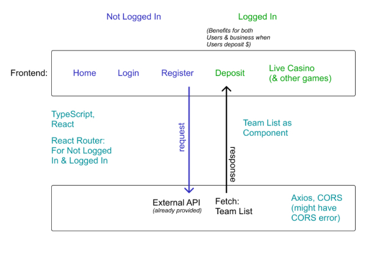
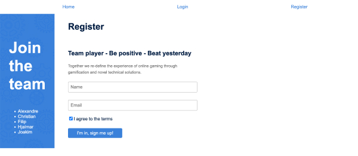

# Team List Project:
- This project is about fetching the name of the team members from a given API and following the design given.
- Showcase all the team members from the team list to the register page.
- In the register page, New User get to sign up.
- Upon successfully registered, the name entered in the input field by the New User will be displayed in the team list.

# System architecture:
- 

# Technologies that I used to build:
- Language: TypeScript.
- Framework: React Tsx, react-router-dom,.
- Libraries: Axios.
- Styling: CSS, Flexbox.

# Steps to run the app in the development mode:
- Step 1: Git clone this repository.
- Step 2: npm install.
- Step 3: npm start: Open [http://localhost:3000](http://localhost:3000) to view it in the browser.
- Step 4: Head on to [http://localhost:3000/register](http://localhost:3000/register) to view and try out the register page with the team list.

# Screenshot of the team list in the register page:
- 

# Things that I would like to improve:
- Write test.
- Refactor.

# Author:
👩 **Katy Rosli**
- GitHub: [@KatyRosli](https://github.com/KatyRosli)

# Show your support:
Give a ⭐️ if you like this project!

Thank you!